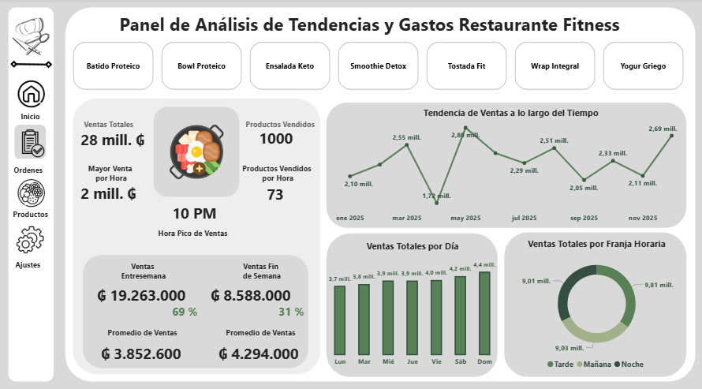
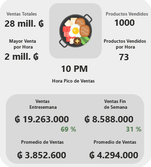

# Panel de Análisis de Tendencias y Ventas — Restaurante Fitness

## Descripción del Proyecto

Este proyecto consiste en un dashboard interactivo desarrollado en Power BI para analizar el comportamiento de ventas de un restaurante fitness en crecimiento.

El objetivo principal es identificar patrones de consumo, horarios de mayor demanda, desempeño de productos y diferencias de comportamiento entre semana y fines de semana, con el fin de apoyar la toma de decisiones comerciales y operativas.

---

## Herramientas Utilizadas

* Power BI
* DAX
* CSV como fuente de datos

---

## Dataset

El análisis se realizó sobre un dataset de 1000 registros simulando operaciones reales de un restaurante fitness durante el período enero–diciembre 2025.

### Variables principales:

* Hora de compra
* Método de pago
* Ingresos
* Producto
* Franja horaria
* Día de la semana
* Fecha

### Productos analizados:

* Bowl Proteico
* Ensalada Keto
* Smoothie Détox
* Wrap Integral
* Batido Proteico
* Tostada Fit
* Yogur Griego

---

## KPIs Principales

* Ventas Totales
* Productos Vendidos
* Mayor Venta por Hora
* Hora Pico de Ventas
* Ventas Entre Semana
* Ventas Fin de Semana
* Promedio de Ventas
* Variación porcentual entre períodos

---

## Análisis Realizado

### Tendencia de ventas en el tiempo

Evaluación del comportamiento de ingresos a lo largo del año para detectar tendencias y variaciones.

### Ventas por día de la semana

Comparación del rendimiento diario para identificar días de mayor actividad.

### Ventas por franja horaria

Análisis de consumo según horarios (mañana, tarde y noche).

### Comparativa entre semana y fines de semana

Evaluación de diferencias en comportamiento de compra y volumen de ventas.

### Análisis operativo por horario

Identificación de horas pico para comprender momentos de mayor demanda.

---

## Insights Clave

* Existen franjas horarias con una concentración significativa de ventas
* Los fines de semana presentan un comportamiento diferente respecto a los días entre semana
* Algunos productos destacan consistentemente sobre otros en volumen de ventas
* Las horas pico permiten identificar momentos críticos para la operación del restaurante

---

## Recomendaciones

* Implementar promociones en horarios de menor actividad
* Optimizar personal y operación durante horas pico
* Potenciar productos con mejor rendimiento comercial
* Diseñar estrategias específicas para fines de semana

---

## Dashboard Interactivo

El panel permite analizar la información de manera visual e interactiva mediante KPIs, gráficos y métricas comparativas.

---

## Vista del Dashboard

## Kpis

## 📥 Descargar Dashboard

Puedes descargar el archivo de Power BI desde aquí:

[Descargar Dashboard Power BI](dashboard/Análisis de Ventas – Restaurante Fitness.pbix)

---

## Conclusión

Este proyecto demuestra cómo el análisis de datos puede utilizarse para entender el comportamiento de clientes, optimizar operaciones y mejorar la toma de decisiones dentro de un negocio gastronómico.
